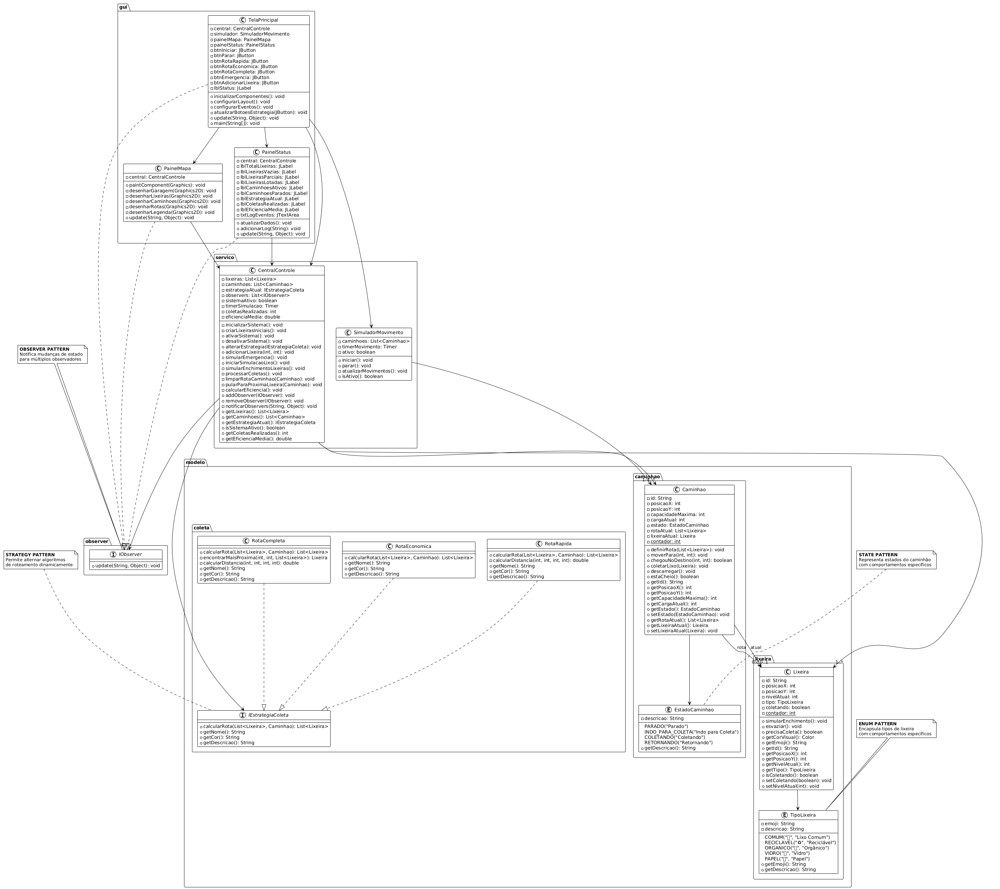

# Sistema de Coleta Inteligente - Cidade Inteligente

## **ESCOPO DO TRABALHO**

Este sistema implementa o **módulo de gerenciamento de resíduos urbanos** do simulador de cidade inteligente. Focamos especificamente na coleta automatizada e otimizada de lixo urbano, utilizando algoritmos inteligentes de roteamento e coordenação de recursos.

**Parte do Simulador:** Gestão de Resíduos Urbanos  
**Integração Futura:** Interfaces bem definidas permitem integração com módulos de trânsito, energia, segurança pública e outros serviços urbanos.

---

## **PROPÓSITO DO SISTEMA**

### **Finalidade:**
Simular um sistema inteligente de coleta de lixo urbano que otimiza rotas, coordena recursos automaticamente e fornece métricas de eficiência em tempo real.

### **Funções Implementadas:**

#### **Gerenciamento de Frota:**
- Coordenação automática de múltiplos caminhões
- Estados dinâmicos (Parado, Indo para Coleta, Coletando, Retornando)
- Controle de capacidade e carga

#### **Monitoramento de Lixeiras:**
- Simulação de enchimento automático
- Diferentes tipos de resíduos (comum, reciclável, orgânico, vidro, papel)
- Detecção automática de necessidade de coleta

#### **Algoritmos Inteligentes:**
- **Rota Rápida:** Prioriza proximidade para resposta rápida
- **Rota Econômica:** Otimiza capacidade dos caminhões
- **Rota Completa:** Algoritmo do vizinho mais próximo para eficiência global

#### **Monitoramento em Tempo Real:**
- Dashboard com estatísticas dinâmicas
- Log de eventos detalhado
- Cálculo de eficiência do sistema
- Visualização gráfica do mapa da cidade

#### **Interação do Usuário:**
- Alternância dinâmica entre estratégias
- Simulação de emergências
- Adição manual de lixeiras
- Controles de ativação/desativação do sistema

---

## **INSTRUÇÕES PARA EXECUTAR**


### **Estrutura de Pastas:**
```
SistemaColetaInteligente/
├── src/
│   ├── gui/                    # Interface gráfica
│   ├── modelo/                 # Entidades de domínio
│   │   ├── lixeira/
│   │   ├── caminhao/
│   │   └── coleta/
│   ├── servico/                # Lógica de negócio
│   └── observer/               # Padrão Observer
└── bin/                        # Arquivos compilados
```

### **Compilação e Execução:**

#### **Método 1: VsCode**
1. Importe o projeto no VsCode
2. Configure `src/` como source folder
3. Execute `gui.TelaPrincipal.main()`

#### **Método 2: Linha de Comando do PowerShell**
```bash
$files = Get-ChildItem -Recurse -Filter *.java -Path src | ForEach-Object { $_.FullName }

javac -d bin -cp src $files

java -cp bin gui.TelaPrincipal
```

### **Como Usar:**
1. **Iniciar:** Clique em "▶️ Ativar Sistema"
2. **Estratégias:** Teste os botões Rota Rápida | Rota Econômica| Rota Completa para ver diferentes comportamentos
3. **Emergência:** Use Emergência para simular situação crítica (Todas as lixeiras ficam cheias)
4. **Adicionar:** use ➕ para adicionar novas lixeiras
5. **Monitorar:** Estatísticas são exibidas no painel direito e logs no console

---

## **DIAGRAMA DE CLASSES**

<p align="center">
  
</p>

---

## **EQUIPE**

*Nícolas Santana Kruger*
*Caio Souza Coelho Gonzaga*
